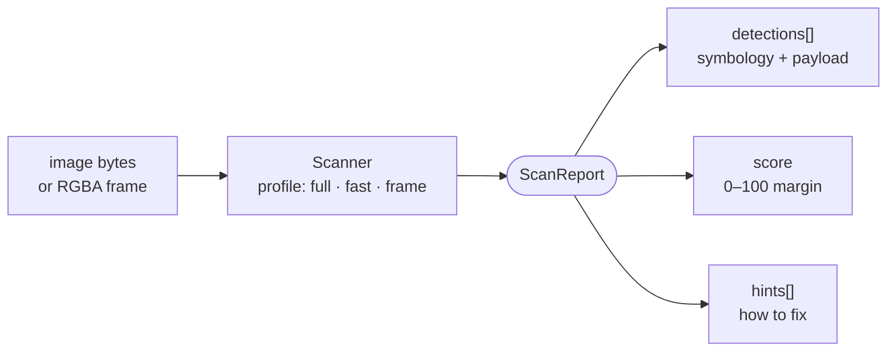

You hand the scanner an image; it hands you back **one report**. Understanding
that report — and which three knobs shape it — is the whole API. This page is
the end-to-end walkthrough; [Quickstart](/quickstart) is the install-per-surface
companion, and [See it in action](/concepts/gallery) shows real images scored.

## The report at a glance

<CardGroup cols={3}>
  <Card title="What decoded" icon="qrcode">
    `detections[]` — the text, its **symbology** (QR? EAN?) and the classified
    **payload** (url · wifi · gs1 · …).
  </Card>
  <Card title="How strong" icon="gauge-high">
    `score` — a **0–100 margin**, not a yes/no. Plus the UEC and the ISO grade card.
  </Card>
  <Card title="What to fix" icon="wand-magic-sparkles">
    `hints[]` — machine-actionable fixes to feed straight back into your generator.
  </Card>
</CardGroup>

## The mental model



Every surface (Rust, CLI, Node, WASM) is the same three steps:

```text
   image bytes ──► Scanner(profile) ──► .scan(input) ──► ScanReport
                       │                     │
                  full|fast|frame      encoded bytes  OR  raw RGBA frame

   ScanReport {
     detections[] { symbology, content, payload, corners, meta, engines }
     score        { value, grade, axes[6], uec, iso15415 }   // null in `frame`
     hints[]      // the generate → scan → act → regenerate feedback
     trace        { total_ms, stages }   // which stage decoded
     versions     { scanner, score_contract }
   }
```

Two ideas do all the work:

1. **`symbology` ≠ `payload.kind`.** One is the *physical code* (QR, EAN,
   DataMatrix — 19 types); the other is what the decoded content *means* (url,
   wifi, gs1 — 13 kinds). A report tells you both.
2. **Decoding is binary; scannability is a spectrum.** `detections` answers
   "did it decode"; `score` answers "how much margin before it fails in the
   wild". The second is the number competitors don't give you.

## Read a real report field by field

This is the actual `qrscan --pretty` output for the clean QR in the gallery:

```text
content   https://qrc-ai.com/76xMa          ← decoded text
symbology QrCode                             ← physical code type
payload   Url { url: "https://qrc-ai.com/76xMa" }   ← classified meaning
symbol    v2 · 25x25 modules                 ← QR version 2, 25×25 grid
engines   rxing+rqrr                          ← both engines decoded, merged
score     89/100 (Excellent)                 ← the margin, not "it decoded"
  resolution   5/5   ← survives every downscale rung
  blur         5/5   ← survives focus/motion blur
  contrast     5/5   ← survives contrast crush
  perspective  5/5   ← survives tilt
  rotation     1/5   ← ⚠ only survives the first rotation rung
  lighting     4/5   ← survives 4 of 5 lighting defects
  uec margin 1.00 (grade A · worst block 0/16 ec)   ← 0 of 16 error-correction codewords spent
iso15415  overall A (informed, not certified)
took      6ms
```

The decode is perfect, but `score` is 89 not 100 — because the **rotation** axis
is weak (1/5). That single line is the actionable truth: this code is healthy
everywhere except a steeply rotated scan. See [Scoring](/concepts/scoring) for
what each axis, the UEC margin, and the ISO card mean.

## The one knob: the profile

| Profile | Budget | Decodes blob/dot art? | Use it for |
|---|---|---|---|
| `full` | ~4 s (override with budget) | **yes** (deep ladder) | generator quality gate · verify flows |
| `fast` | ~800 ms | no | upload tools where latency beats recall |
| `frame` | ~80 ms | no (decode only, **no score**) | per-frame camera loops |

<Warning>
The `fast` profile does **not** decode the blob/dot pixel template class — the
exact styles a generator outputs. For any verify-the-output flow, use `full`
(bound it with a `budget_ms` in UI contexts).
</Warning>

## A recipe per use-case

<AccordionGroup>
  <Accordion title="Generator quality meter (web verify)" icon="gauge-high">
    Generate → scan the output → map the score to a meter. One call replaces a
    hand-tuned filter loop; the meter becomes margin-truthful.

    ```ts
    const report = scan_image(bytes, "full", undefined, undefined, 1500);
    const score = report.detections.length ? (report.score?.value ?? 0) : -1;
    const status =
      score < 0  ? "NO"   :   // nothing decoded — regenerate
      score >= 80 ? "HIGH" :
      score >= 60 ? "MEDIUM" : "LOW";
    ```

    This is exactly the qrcode-ai.com editor flow — see
    [Nuxt verify](/guides/nuxt-verify).
  </Accordion>

  <Accordion title="Import / upload tool (classify & route)" icon="file-arrow-up">
    Decode any dropped or pasted code, then route on `payload.kind` — the
    classifier already split the content for you.

    ```ts
    const d = report.detections[0];
    switch (d?.payload.kind) {
      case "url":     return openUrl(d.payload.url);
      case "wifi":    return prefillWifi(d.payload);     // ssid, security, password
      case "gs1":     return showProduct(d.payload.gtin);
      case "me_card": return prefillContact(d.payload);
      default:        return showText(d?.content.text);
    }
    ```

    Works for QR **and** barcodes (EAN, Code 128, DataMatrix…) — same report shape.
  </Accordion>

  <Accordion title="Live camera (frames)" icon="camera">
    Skip the PNG roundtrip — feed raw `ImageData` and use the tight `frame`
    profile (decode only, no scoring).

    ```ts
    const img = ctx.getImageData(0, 0, w, h);
    // args: data, width, height, profile, budget_ms
    const report = scan_frame(new Uint8Array(img.data.buffer), w, h, "frame", 80);
    if (report.detections.length) onHit(report.detections[0].content.text);
    ```

    Run it in a Worker so the UI thread stays free.
  </Accordion>

  <Accordion title="AI / agent regenerate loop" icon="robot">
    The `hints` are designed to drive generation **without image analysis** —
    feed them straight back into the generator.

    ```text
    generate(params) → scan(full) →
      ├─ no detection         → adjust per trace.stages, retry
      ├─ hints present        → apply mapped fix (raise EC, clear finder, …)
      └─ score ≥ gate & no hints → accept
    ```

    Full hint→action table: [For agents](/guides/agents).
  </Accordion>

  <Accordion title="Retail / GS1 badge" icon="barcode">
    A GS1 Digital Link that validates earns a badge no competitor surfaces.

    ```ts
    const p = report.detections[0]?.payload;
    if (p?.kind === "gs1_digital_link" && p.conformant) showBadge("Retail-ready ✓");
    else if (p?.kind === "gs1" && !p.conformant)        showIssues(p.issues); // each cites its GS1 rule
    ```

    See [GS1](/concepts/gs1) for the conformance verdict shape.
  </Accordion>

  <Accordion title="Print / packaging gate" icon="print">
    A stricter bar than web — demand error-correction headroom and zero hints.

    ```text
    accept if: score ≥ 80
           AND uec.grade ∈ {a, b}
           AND no hints
           AND (retail) payload.conformant === true
    ```

    And always reject on a `low_correction_margin` hint — it means the decode
    sat at the Reed-Solomon limit (miscorrection risk).
  </Accordion>
</AccordionGroup>

## Where to go next

<CardGroup cols={2}>
  <Card title="See it in action" icon="images" href="/concepts/gallery">
    Real QR images scored — clean, artistic, occluded, retail.
  </Card>
  <Card title="Scoring" icon="gauge-high" href="/concepts/scoring">
    What each axis, the UEC margin, and the ISO grade card mean.
  </Card>
  <Card title="The decode pipeline" icon="layer-group" href="/concepts/pipeline">
    The five deterministic stages, S1 → S5 rescue.
  </Card>
  <Card title="The report" icon="file-code" href="/api/report">
    Every field of the ScanReport contract.
  </Card>
</CardGroup>
